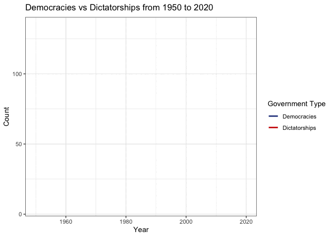

Tidy Tuesday Week 10
================
Annie Deck
2024-11-05

- [Load libraries](#load-libraries)
- [Bring in data](#bring-in-data)
  - [Democracy and Dictatorship](#democracy-and-dictatorship)
- [Data wrangling](#data-wrangling)
- [Plotting](#plotting)
- [Things I learned](#things-i-learned)

# Load libraries

``` r
library(tidyverse)
library(here)
library(gganimate)
```

# Bring in data

## Democracy and Dictatorship

``` r
##Bring in directly from GitHub
democracy_data <- readr::read_csv('https://raw.githubusercontent.com/rfordatascience/tidytuesday/master/data/2024/2024-11-05/democracy_data.csv')

##Take a look at the data
glimpse(democracy_data)
```

    ## Rows: 14,768
    ## Columns: 43
    ## $ country_name                <chr> "Afghanistan", "Afghanistan", "Afghanistan…
    ## $ country_code                <chr> "AFG", "AFG", "AFG", "AFG", "AFG", "AFG", …
    ## $ year                        <dbl> 1950, 1951, 1952, 1953, 1954, 1955, 1956, …
    ## $ regime_category_index       <dbl> 5, 5, 5, 5, 5, 5, 5, 5, 5, 5, 5, 5, 5, 5, …
    ## $ regime_category             <chr> "Royal dictatorship", "Royal dictatorship"…
    ## $ is_monarchy                 <lgl> TRUE, TRUE, TRUE, TRUE, TRUE, TRUE, TRUE, …
    ## $ is_commonwealth             <lgl> FALSE, FALSE, FALSE, FALSE, FALSE, FALSE, …
    ## $ monarch_name                <chr> "Mohammed Zahir Shah", "Mohammed Zahir Sha…
    ## $ monarch_accession_year      <dbl> 1933, 1933, 1933, 1933, 1933, 1933, 1933, …
    ## $ monarch_birthyear           <dbl> 1914, 1914, 1914, 1914, 1914, 1914, 1914, …
    ## $ is_female_monarch           <lgl> FALSE, FALSE, FALSE, FALSE, FALSE, FALSE, …
    ## $ is_democracy                <lgl> FALSE, FALSE, FALSE, FALSE, FALSE, FALSE, …
    ## $ is_presidential             <lgl> FALSE, FALSE, FALSE, FALSE, FALSE, FALSE, …
    ## $ president_name              <chr> NA, NA, NA, NA, NA, NA, NA, NA, NA, NA, NA…
    ## $ president_accesion_year     <dbl> NA, NA, NA, NA, NA, NA, NA, NA, NA, NA, NA…
    ## $ president_birthyear         <dbl> NA, NA, NA, NA, NA, NA, NA, NA, NA, NA, NA…
    ## $ is_interim_phase            <lgl> NA, NA, NA, NA, NA, NA, NA, NA, NA, NA, NA…
    ## $ is_female_president         <lgl> NA, NA, NA, NA, NA, NA, NA, NA, NA, NA, NA…
    ## $ is_colony                   <lgl> FALSE, FALSE, FALSE, FALSE, FALSE, FALSE, …
    ## $ colony_of                   <chr> NA, NA, NA, NA, NA, NA, NA, NA, NA, NA, NA…
    ## $ colony_administrated_by     <chr> NA, NA, NA, NA, NA, NA, NA, NA, NA, NA, NA…
    ## $ is_communist                <lgl> FALSE, FALSE, FALSE, FALSE, FALSE, FALSE, …
    ## $ has_regime_change_lag       <lgl> FALSE, FALSE, FALSE, FALSE, FALSE, FALSE, …
    ## $ spatial_democracy           <dbl> 0.00, 0.00, 0.25, 0.25, 0.25, 0.25, 0.25, …
    ## $ parliament_chambers         <dbl> 2, 2, 2, 2, 2, 2, 2, 2, 2, 2, 2, 2, 2, 2, …
    ## $ has_proportional_voting     <lgl> FALSE, FALSE, FALSE, FALSE, NA, NA, NA, NA…
    ## $ election_system             <chr> NA, NA, NA, NA, NA, NA, NA, NA, NA, NA, NA…
    ## $ lower_house_members         <dbl> 171, 171, 171, 171, NA, NA, NA, NA, NA, NA…
    ## $ upper_house_members         <dbl> NA, NA, NA, NA, NA, NA, NA, NA, NA, NA, NA…
    ## $ third_house_members         <dbl> NA, NA, NA, NA, NA, NA, NA, NA, NA, NA, NA…
    ## $ has_new_constitution        <lgl> FALSE, FALSE, FALSE, FALSE, FALSE, FALSE, …
    ## $ has_full_suffrage           <lgl> FALSE, FALSE, FALSE, FALSE, FALSE, FALSE, …
    ## $ suffrage_restriction        <chr> "Male vote only", "Male vote only", "Male …
    ## $ electoral_category_index    <dbl> 2, 2, 2, 2, 2, 2, 2, 2, 2, 2, 2, 2, 2, 2, …
    ## $ electoral_category          <chr> "non-democratic multi-party elections", "n…
    ## $ spatial_electoral           <dbl> 1.50, 1.50, 1.75, 1.75, 1.75, 1.75, 1.75, …
    ## $ has_alternation             <lgl> FALSE, FALSE, FALSE, FALSE, FALSE, FALSE, …
    ## $ is_multiparty               <lgl> TRUE, TRUE, TRUE, TRUE, TRUE, TRUE, TRUE, …
    ## $ has_free_and_fair_election  <lgl> FALSE, FALSE, FALSE, FALSE, FALSE, FALSE, …
    ## $ parliamentary_election_year <dbl> 0, 0, 1, 0, 0, 1, 0, 0, 1, 0, 0, 1, 0, 0, …
    ## $ election_month              <chr> NA, NA, "February", NA, NA, NA, NA, NA, NA…
    ## $ election_year               <dbl> NA, NA, 1952, NA, NA, NA, NA, NA, NA, NA, …
    ## $ has_postponed_election      <lgl> FALSE, FALSE, FALSE, FALSE, FALSE, FALSE, …

``` r
##Save to data folder 
readr::write_csv(democracy_data, here::here("Tidy_Tuesday", "Week_10", "Data", "outer_space_objects.csv"))
```

# Data wrangling

``` r
##First I am going to pull out only the columns I am interested in to simplify 
democracy_data_cleaned <- democracy_data %>%
  select(c(year, is_democracy, is_communist)) %>% ##lets compare number of democracies and number of communist countries
  group_by(year) %>% ##group by year
  summarize(Democracies = sum(is_democracy, na.rm = TRUE),
    Dictatorships = sum(is_communist, na.rm = TRUE)) %>%
  pivot_longer(cols = c(Democracies, Dictatorships),
    names_to = "government_type",
    values_to = "count")
```

# Plotting

``` r
democracy_plot <- democracy_data_cleaned %>% ##plug in cleaned data
  ggplot(aes(x = year,
             y = count, 
             color = government_type)) + #different color for each category 
  geom_line(linewidth = 1) + #make it a line plot
  theme_bw() + #add a theme to make it look nicer
  transition_reveal(year) + ##animate so it adds data by year
  labs(title = "Democracies vs Dictatorships from 1950 to 2020", ##fix axis lables and title
       x = "Year",
       y = "Count",
       color = "Government Type") +
  scale_color_manual(values=c("royalblue4", "red3"))


##Now lets look at the plot 
democracy_plot
```

<!-- -->

# Things I learned

- I tried an animated line plot using the package gganimate to plot the
  data points by year.
- I also tried the pdf output for the first time
