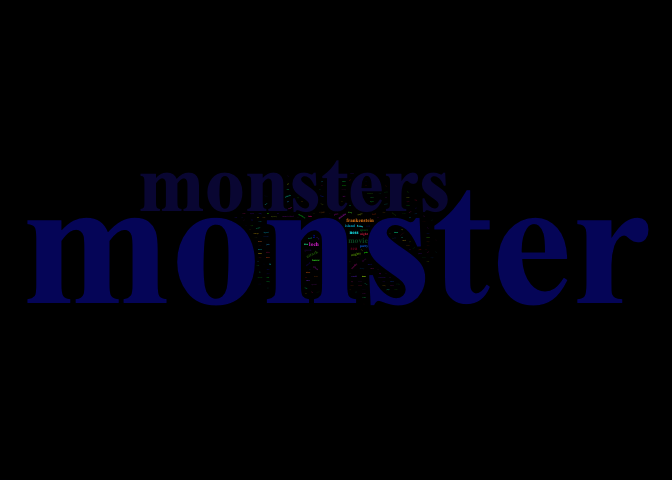
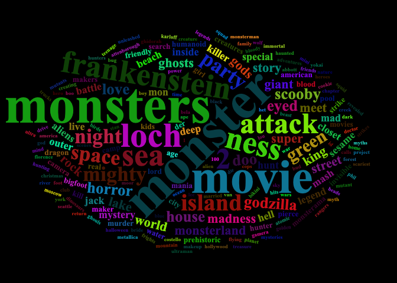

Tidy Tuesday- Monsters
================
Annie Deck
2024-11-11

- [Load libraries](#load-libraries)
- [Bring in data](#bring-in-data)
  - [Monster Movies](#monster-movies)
- [Prepping and cleaning data](#prepping-and-cleaning-data)
- [Making word cloud](#making-word-cloud)

# Load libraries

``` r
library(tidyverse)
library(here)
library(wordcloud2)
library(tidytext)
```

# Bring in data

## Monster Movies

``` r
##read directly from GitHub
monster_movie_genres <-readr::read_csv('https://raw.githubusercontent.com/rfordatascience/tidytuesday/master/data/2024/2024-10-29/monster_movie_genres.csv')

monster_movies <- readr::read_csv('https://raw.githubusercontent.com/rfordatascience/tidytuesday/master/data/2024/2024-10-29/monster_movies.csv')

##Take a look at the data
glimpse(monster_movies)
```

    ## Rows: 630
    ## Columns: 10
    ## $ tconst          <chr> "tt0016123", "tt0023236", "tt0031208", "tt0033879", "t…
    ## $ title_type      <chr> "movie", "movie", "movie", "movie", "movie", "movie", …
    ## $ primary_title   <chr> "The Monster", "The Monster Walks", "The Human Monster…
    ## $ original_title  <chr> "The Monster", "The Monster Walks", "The Dark Eyes of …
    ## $ year            <dbl> 1925, 1932, 1939, 1941, 1941, 1942, 1942, 1942, 1944, …
    ## $ runtime_minutes <dbl> 86, 57, 73, 59, 65, 77, 73, 63, 86, 62, 61, 295, 201, …
    ## $ genres          <chr> "Comedy,Horror,Mystery", "Horror,Mystery", "Crime,Dram…
    ## $ simple_title    <chr> "the monster", "the monster walks", "the human monster…
    ## $ average_rating  <dbl> 6.2, 4.1, 5.7, 6.1, 6.0, 3.5, 6.1, 6.1, 5.7, 4.8, 4.9,…
    ## $ num_votes       <dbl> 1412, 1120, 1579, 1953, 799, 1969, 1938, 1588, 504, 12…

``` r
##Save to data folder 
readr::write_csv(monster_movies, here::here("Tidy_Tuesday", "Monsters", "Data", "monster_movies.csv"))
```

# Prepping and cleaning data

``` r
##remove punctuation from primary titles
monster_movies_clean <- monster_movies %>%
  select(primary_title) %>%
  mutate(primary_title = str_replace_all(primary_title, "[[:punct:]]", " "))

##create word counts
word_counts <- monster_movies_clean %>%
  unnest_tokens(word, primary_title) %>% #break down into individual words
  anti_join(stop_words) %>%   #Remove stop words
  count(word, sort = TRUE) %>% #Count word frequencies
  filter(n >= 2) # Only keep words that appear at least twice
```

# Making word cloud

``` r
#make word cloud
wordcloud2(word_counts,
          size = 1,
          color = "random-dark",
          backgroundColor = "black",
          rotateRatio = 0.3,
          shape = "circle")
```

<!-- -->

``` r
##"monster" and "monsters" seems very dominant where I can not easily see the other words
##in an attempt to improve this I am going to cap maximum frequency at 20 
word_counts <- monster_movies %>%
  select(primary_title) %>%
  mutate(primary_title = str_replace_all(primary_title, "[[:punct:]]", " ")) %>%
  unnest_tokens(word, primary_title) %>%
  anti_join(stop_words) %>%
  count(word, sort = TRUE) %>%
  mutate(n = if_else(n > 20, 20, n)) %>%  # Cap frequency at 20
  filter(n >= 2)

##trying world cloud again
wordcloud2(word_counts,
          size = 0.5,
          color = "random-dark",
          backgroundColor = "black",
          rotateRatio = 0.5,
          minSize = 0.1,
          shape = "circle")
```

<!-- -->
